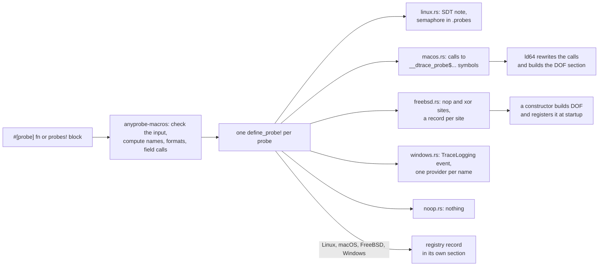
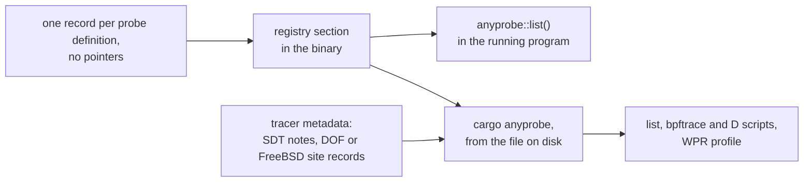

# Architecture

How the workspace is laid out and why each backend works the way it does.
Limitations are in [GAPS.md](GAPS.md) and costs in
[PERFORMANCE.md](PERFORMANCE.md), which also shows what each tracer does when
it attaches.

## Crates

| Crate | Role |
|---|---|
| `anyprobe-macros` | The `probes!` macro and the `#[probe]` attribute. Target-independent: it checks the input, computes every string a backend needs and emits one `define_probe!` per probe. |
| `anyprobe` | The facade and runtime. One backend module per platform, the encoder, the registry and the public `Native` trait. All `asm!` and `unsafe` live here. |
| `cargo-anyprobe` | The `cargo anyprobe` binary. Reads the registry and the tracer metadata from a built file and writes scripts. |
| `anyprobe-check` | Unpublished. One probe per argument kind, so a library build reaches every backend's code generation. |
| `anyprobe-spike` | Unpublished. Hand-written probes, the attach and capture scripts, and the first FreeBSD prototype. |

The macros and the runtime are released together with an exact version
requirement, so generated code always matches the runtime it calls.
`__private` is outside the semver contract for the same reason.

## Macros

`probes!` and `#[probe]` produce the same thing: a module per probe holding
`enabled()` and `fire(..)`, defined by the backend's `macro_rules!`. The macro
crate never emits `asm!` or `unsafe`, so a change to a platform's probe format
is a change in one backend file.

`#[probe]` puts its probe modules and their `#[cold]` helpers inside the
function body and runs the original body through `call_once`. Encoding lives in
the cold helpers so that the code on the hot path is the enabled check and
nothing else. Generated code is compiled under the caller's lints, so it uses
absolute paths, `__anyprobe_`-prefixed names and the `allow`s it needs.

## Backends

| Target | Probe | Enabled check | Registration |
|---|---|---|---|
| Linux | SystemTap SDT v3 note from `asm!` | the SDT semaphore, in `.probes` | none |
| macOS | DTrace USDT, as linker relocations the linker turns into DOF | DTrace's is-enabled probe | none |
| FreeBSD (x86-64) | DTrace USDT: a `nop` plus a site record, turned into DOF at startup | DTrace's is-enabled probe, an `xor eax, eax` site | an `.init_array` constructor per executable or library; `.fini_array` unregisters |
| Windows | ETW TraceLogging event, one per probe | an atomic flag the provider's enable callback sets | on the first enabled check, `atexit` unregisters |
| other | nothing | `false` | none |

### Linux

Notes come from `asm!` rather than a C helper, so the build needs no C
compiler. A site uses numeric local labels, so inlining or monomorphization
can copy it and each copy is another site under the same probe name.

The semaphore is the enabled check, and the only way a probe knows a tracer
is attached. The kernel raises it by file offset, in the first writable
mapping of that file page. rust-lld writes the RELRO and data segments back to
back, so each object emits one retained, page-aligned byte in `.probes` to keep
the semaphores off the RELRO page. Sites that pass pointers are `readonly`,
never `nomem`, since the tracer reads memory through them.

### macOS

Call sites are `asm!` calls to `__dtrace_probe$...` and
`__dtrace_isenabled$...`. ld64 rewrites them to `nop` and builds the DOF
section, so the runtime registers nothing. A probe site must be an `asm!`
call and not a Rust call: a Rust call that ends a function compiles to a tail
call, and the rewritten site would fall through into the next function.

### FreeBSD

FreeBSD's own toolchain runs `dtrace -G` over object files to rewrite probe
calls and link in DOF, plus `drti.o`, whose constructor registers the DOF.
That needs a step between compiling and linking, which Cargo does not have.
Instead each site is emitted in its final form: a probe site is a `nop` with
the arguments in the System V argument registers, an is-enabled site is
`xor eax, eax`, which `fasttrap` emulates as setting `eax` to 1 while the
probe is enabled. Next to each, `asm!` writes a record into `anyprobe_sites`
with the site's address, the provider, the probe name as DTrace spells it,
the function and the C type of each argument. At startup a constructor in
`.init_array` reads the section between its `__start_` and `__stop_`
symbols, builds DOF with the `dof` crate and registers it with the
`DTRACEHIOC_ADDDOF` ioctl on `/dev/dtrace/helper`, as `drti.o` does. A
`.fini_array` destructor unregisters it, so a library unloaded with
`dlclose` leaves no tracepoints behind.

- Each executable or library registers its own sites: the section bounds,
  the constructor and the registration state are per object.
- The DOF buffer lives as long as the object. The kernel tells registrations
  apart by the buffer's address, so a freed and reused buffer would make the
  next library's registration fail.
- A site record holds the site's address, which the dynamic linker
  relocates, so the records cannot share the registry section, whose records
  hold no pointers.
- Two functions that define one probe name get one DOF probe each, keyed by
  function and argument types, as ld64 does on macOS.
- Registration can fail (DTrace not loaded, no access to the device). The
  constructor never prints or panics; `anyprobe::registration()` reports the
  result.

The macros pass the same `dtrace` block to every backend; FreeBSD reads the
DTrace probe name, the function, the C types and the x86-64 registers from
it.

### Windows

The provider is `tracelogging_dynamic`, so each probe is an event whose
metadata is built at runtime from the same strings the other backends use.
One provider registration is shared by every probe of that name in the
process, since ETW limits registrations per process. The enable callback
updates every probe's flag under a lock; a probe added later copies the
provider's current state under the same lock, so no change is lost.

### Other targets

Probes compile to nothing, and the enabled check is the constant `false`, so
arguments are never computed. FreeBSD on architectures other than x86-64 is
in this group.

## Decisions behind the macros

- `#[probe]` runs the body through `call_once(impl FnOnce() -> R)` rather
  than calling a closure directly. A closure called in place is inferred
  `FnMut`, and a `&mut self` method could then not return a borrow of
  `self`.
- An `async fn` stays an `async fn`, with the checks as ordinary statements
  in its body, rather than returning a wrapper future. `Send`, lifetimes and
  `async fn` in traits therefore behave as they did without the attribute.
  `poll` and `pending` probes would need a wrapper and are not provided.
- The cold helpers are not generic. Encoded arguments reach them as a
  `Value`, an enum of the native kinds plus `&dyn Debug` and an object-safe
  `Serialize`, so a generic function gets one helper and one probe site, not
  one per instantiation, and the probe module never names the caller's
  types.
- The provider is given per attribute and defaults to the crate name. A
  crate-root `provider!` cannot work: a proc macro cannot read it, and a
  `macro_rules!` callback through `crate::` is rejected for macro-expanded
  `macro_export` macros.
- A crate name that ends in a digit (`http2`, `sha2`) gets a `_` after it as
  the default provider, since DTrace appends the pid to the provider name.
  The alternatives were a provider read from the environment, set by a
  `build.rs` with `cargo:rustc-env`, or from `[package.metadata.anyprobe]`.
  Both need configuration in every such crate, and the manifest needs a TOML
  parser in the proc macro and a way to track the file for rebuilds. The rule
  needs nothing, gives the same name on every platform, and a name given
  with `provider` is used as written and still rejected if it ends in a
  digit. Either alternative could be added later without changing the
  rule.
- `autoref` chooses `Serialize`, then `Debug`, and never `Native`. The proc
  macro has to know each argument's operand count, and a trait-selected
  native encoding would change it.
- `u128` and `i128` are not native: they would need two operands, in a
  format no tracer reads as one value. `debug` covers them.
- `--cfg anyprobe_dylib` is a cfg, not a Cargo feature. Cargo unifies
  features, so one crate enabling it would slow the checks of every crate in
  the build.

## Argument encoding

`serde` and `debug` values are written into a thread-local buffer and passed as
a pointer and a length, with a NUL after the bytes. Values are cut at 4096
bytes on a character boundary, and a cut value ends with `...` in place of
its last bytes. The marker uses none of the six argument slots and needs no
change in a tracer; a flag operand would have taken a slot from every
encoded probe. Once a write does not fit, the encoder refuses every later
write, so a short one cannot land after the gap. The limit is a constant:
the tracers' own defaults (64 bytes for bpftrace, 256 for dtrace) are lower,
and a runtime setter can be added later without breaking anything. A probe that fires while another is being
written on the same thread is dropped, not panicked on.

`autoref` picks `Serialize`, then `Debug`, by method resolution on a wrapper
in the caller's crate, since the macro cannot see types. It is additive: code
that compiles without the feature encodes the same with it, because Cargo
unifies features across the dependency graph.

## Registry

Each probe definition also emits one record: a `#[used]` static byte array in
a section of its own, built at compile time from a `concat!` the macro writes.
A record holds no pointers, so `anyprobe::list()` in the running program and
`cargo anyprobe` on a file read the same bytes, for any target, with no
relocation processing. This is why the registry is not a `linkme` slice, whose
elements hold pointers.

| Format | Section |
|---|---|
| ELF (Linux, FreeBSD) | `anyprobe_probes`, a C identifier, so `__start_` and `__stop_` bound it |
| Mach-O | `__DATA,__anyprobe` with `no_dead_strip`, bounded by `section$start` and `section$end` |
| PE | `.aprobe$b` between `.aprobe$a` and `.aprobe$c` markers; each record's object carries an `/INCLUDE:` directive, which `/OPT:REF` honours |

The parser skips zero padding between records, rejects an unknown version, and
never panics on malformed input. A change to the record layout bumps
`registry::VERSION`, and the macros, the parser and `cargo-anyprobe` change
with it.

## `cargo anyprobe`

It reads a built file with `goblin` (ELF, Mach-O including fat files, PE) and
`dof` (DOF sections), and never runs the file. Where the file carries tracer
metadata (SDT notes, DOF, a FreeBSD site table), `list` compares it with the
registry to mark a probe whose code the linker removed. From a FreeBSD site
table it reads only the provider and probe names, which need no relocation. `--bin` and `--example` run `cargo build` and
take the executable from its JSON messages.

## Verification

Unit and integration tests run everywhere. Compile-fail cases run under
trybuild; those whose output is rustc's own wording run on a pinned toolchain.
Behaviour a tracer sees is checked by the attach scripts in
`spike/scripts/`, once per OS, with exact event counts.
