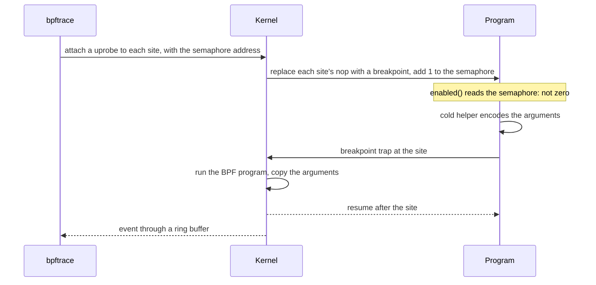
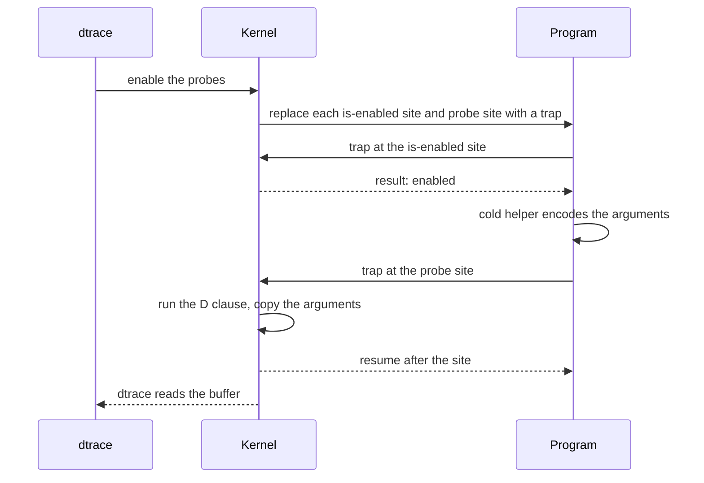
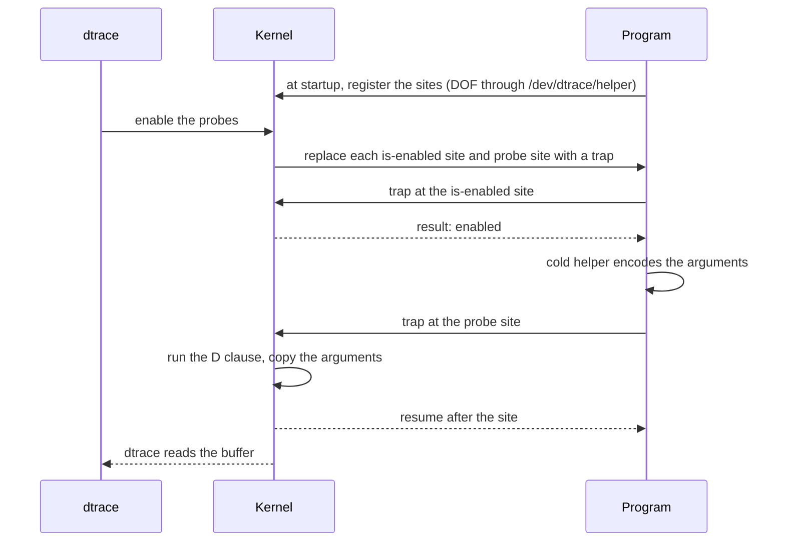
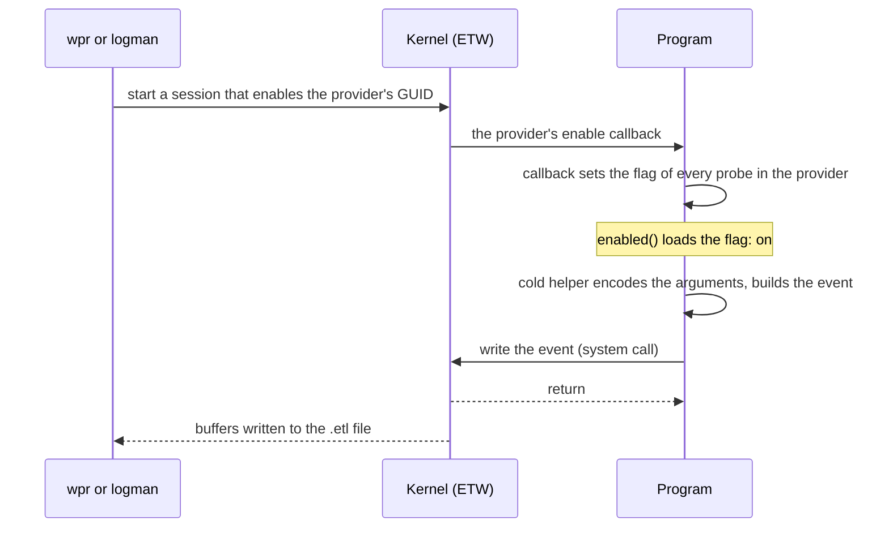

# Performance

What a probe costs with no tracer attached, what it costs while a tracer
records it, and how each platform differs.

| Target | No tracer attached, per probe | Tracer attached, per firing |
|---|---|---|
| Linux | one load and compare of the SDT semaphore: about 0.4 ns | one breakpoint trap into the kernel and the tracer's BPF program: 0.4 to 0.6 µs measured with bpftrace, about 1.2 µs with `perf record` |
| macOS | one instruction that ld64 wrote to set the result to false: about 0.16 ns | two traps into the kernel and the D clause: 0.7 to 2.3 µs measured |
| FreeBSD (x86-64) | one `xor eax, eax`: about 0.37 ns | two traps into the kernel and the D clause: 1.0 to 1.3 µs measured, in a virtual machine |
| Windows | one load of an atomic flag: about 0.24 ns | no trap; the event is built in the process and written with one system call: 0.4 to 0.5 µs measured |
| other targets | nothing; the check is the constant `false` | no tracer |

## With no tracer attached

A probe compiles to an enabled check and a branch to a `#[cold]`,
`#[inline(never)]` helper. Only the helper computes and encodes the
arguments, so with no tracer attached the arguments are never evaluated, a
`debug` or `serde` argument is never formatted, and nothing is allocated.
The check on each platform:

- **Linux:** a 16-bit load of the probe's SDT semaphore, compared with zero.
  The kernel raises the semaphore when a tracer attaches to the probe.
- **macOS:** ld64 rewrites each is-enabled call to an instruction that sets
  the result to zero (`mov x0, #0` on AArch64, `xor eax, eax` on x86-64),
  and each probe call to a `nop`.
- **FreeBSD:** the site is `xor eax, eax`, which sets the result to zero,
  and each probe site a `nop`. The binary's constructor registers both with
  the kernel at startup, once per executable or library.
- **Windows:** a relaxed load of an `AtomicU8` that the ETW enable callback
  sets. The first check of a provider in the process registers it with ETW,
  once.
- **Other targets:** the check is the constant `false` and the compiler
  removes the probe.

Measured with criterion: a function with an entry and a return probe against
the same function without them, as in `crates/anyprobe/benches/disabled_cost.rs`.

| Machine | Without probes | With two probes | Per probe |
|---|---|---|---|
| Apple M1, macOS | 0.95 ns | 1.27 ns | 0.16 ns |
| AMD Threadripper 1950X, Linux x86-64 | 1.63 ns | 2.40 ns | 0.39 ns |
| Same machine, Windows x86-64 | 1.91 ns | 2.40 ns | 0.24 ns |
| Same machine, FreeBSD 15.0 x86-64 in a KVM virtual machine | 1.65 ns | 2.39 ns | 0.37 ns |

- Most of the difference is the register saves the cold calls need, not the
  checks. On Linux x86-64 a function with one check measured the same as one
  without: LLVM moved the saves into the cold path. With two checks they stay
  on the hot path.
- On macOS a `#[probe]` function compiles to the same 17-instruction hot
  path as a hand-written pair of checks, against 7 instructions without
  probes.
- A probed function can still be inlined. Each inlined copy is another site
  under the same probe name.
- `--cfg anyprobe_dylib` (Linux, Rust `dylib` crates only) loads the
  semaphore through the GOT: 0.98 ns instead of 0.77 ns for two probes on the
  Threadripper.
- `unwind` adds a guard flag. An `async fn` draws an invocation id only when
  its entry probe is enabled.
- Size: each probe adds its cold helper, its tracer metadata (an SDT note, a
  DOF entry or a FreeBSD site record per site) and a registry record of
  about 150 bytes.
- On FreeBSD, startup also builds and registers the DOF, once per executable
  or library that links anyprobe. See [FreeBSD startup](#freebsd-startup).

Run the benchmark with `cargo bench -p anyprobe --bench disabled_cost`.
Differences below a nanosecond are within the noise of a laptop on battery or
under load; the instruction count is the steadier comparison.

### FreeBSD startup

Before `main` (or before `dlopen` returns), the constructor parses the site
table, builds the DOF and passes it to the kernel with one `ioctl`; at exit
or unload a second `ioctl` removes it. Measured with
`spike/scripts/startup-cost-freebsd.sh` on FreeBSD 15.0-RELEASE in a KVM
virtual machine on the Threadripper above: programs with N probes, each probe
with one probe site and one is-enabled site, against the same program with
no probes, as the wall time of one run, best of three rounds of 400 runs.

| Probes | Extra time per run, DTrace not loaded | Extra time per run, DTrace loaded | `ADDDOF` ioctl | `REMOVE` ioctl |
|---|---|---|---|---|
| 10 | 0.03 ms | 1.4 ms | 0.03 ms | 0.01 ms |
| 100 | 0.4 ms | 2.1 ms | 0.2 ms | 0.01 ms |
| 1,000 | 3.4 ms | 7.1 ms | 1.2 ms | 0.06 ms |
| 3,000 | 9.0 ms | 17.9 ms | 4.5 ms | 3.7 ms |

- With DTrace not loaded, the constructor parses and builds the DOF, then
  fails to open `/dev/dtrace/helper`. That column is the program's own
  work: about 3 µs per probe.
- With DTrace loaded, a program with 10 probes spent 0.1 ms more between
  `exec` and `_exit` than one with none, measured with the `proc` and
  `syscall` providers. The rest of the 1.4 ms comes after the process
  exits, so the program does not see it, but a parent waiting for a short
  program does. The kernel's handling of it was not broken down further.
- The two `ioctl` columns are medians of 9 runs under `ktrace`.
- A process with no probe sites makes no `ioctl`.

## With a tracer attached

While a tracer records a probe, each firing runs the cold helper, which
encodes the arguments, and then hands control to the tracer. On Linux, macOS
and FreeBSD that is a trap into the kernel. On Windows the program writes the
event itself.

### Linux



The semaphore is raised once, when the tracer attaches, and costs nothing per
firing. Each firing is one trap. The kernel's uprobe benchmark (commit
`d41bc48bfab2`, "selftests/bpf: Add uprobe triggering overhead benchmarks",
Linux 5.17) measured about 0.56 µs for a uprobe on a `nop`, which is what an
SDT site is, against 1.4 µs on another instruction. Later kernels have made
uprobes faster.

Measured with the `overhead` example on an AMD Threadripper 1950X, Ubuntu
24.04 (Linux 6.8), `schedutil` governor, bpftrace 0.20.2 and perf 6.8.12,
1,000,000 calls of each function, each call firing an entry and a return
probe:

| Tracer action on every probe | `native` | `encoded` |
|---|---|---|
| none attached | 2.6 ns per call | 2.0 ns per call |
| bpftrace, `@[probe] = count()` | 890 ns per call | 1111 ns per call |
| bpftrace, `printf` of every argument | 1153 ns per call | 1418 ns per call |
| `perf record` to a file | 2348 ns per call | 2611 ns per call |

That is 0.4 to 0.6 µs per firing under bpftrace, in line with the kernel's
benchmark, with `encoded` about 0.1 µs higher for formatting its argument
with `{:?}`. The counting run saw all 8,000,000 firings. The `printf` run
lost 4,678,478 of them: bpftrace could not drain its ring buffer as fast as
the example filled it, so that row is a lower bound on the cost of printing
every firing. `perf record` costs about twice as much per firing, about
1.2 µs. It wrote 769 MB and reported one lost chunk; `perf script` read
8,000,262 samples against the 8,000,000 the example fires. Each figure is one
run.

### macOS



Each firing is two traps: the enabled check is a site of its own. Measured
with the `overhead` example on an Apple M1, macOS 27.0, DTrace `Sun D 1.19`,
SIP on, 1,000,000 calls of each function, each call firing an entry and a
return probe. Each cell is the median of three runs, with the range in
brackets:

| dtrace action on every probe | `native` | `encoded` |
|---|---|---|
| none attached | 3.1 ns per call (3.1 to 3.1) | 3.3 ns per call (2.9 to 3.4) |
| `@[probename] = count()` | 4267 ns per call (4265 to 4267) | 4604 ns per call (4603 to 4614) |
| `printf` of every argument | 1468 ns per call (1440 to 1483) | 3326 ns per call (3323 to 3345) |

That is 0.7 to 2.3 µs per firing, and the three runs of each attached row
agree to within 3%. Every counting run saw all 8,000,000 firings (the timed
pass and an untimed warm-up pass), and dtrace reported no drops in any run.
Counting costs about three times as much per firing as `printf` for
`native`; the runs do not show why. Formatting the small struct in `encoded`
with `{:?}` adds about 0.3 µs per call when counting and 1.9 µs when
printing. The unprobed `baseline` function took 3.1 to 3.5 ns per call with
no tracer and 1.3 ns under dtrace, so a difference of a few nanoseconds in
the first row is within that spread.

### FreeBSD



As on macOS, each firing is two traps. Measured with the `overhead` example
on FreeBSD 15.0-RELEASE in a KVM virtual machine on the AMD Threadripper
1950X above, DTrace `Sun D 1.13`, 1,000,000 calls of each function, each
call firing an entry and a return probe:

| dtrace action on every probe | `native` | `encoded` |
|---|---|---|
| none attached | 4.0 ns per call | 3.7 ns per call |
| `@[probename] = count()` | 2292 ns per call | 2506 ns per call |
| `printf` of every argument | 1940 ns per call | 2178 ns per call |

That is 1.0 to 1.3 µs per firing, with `encoded` about 0.1 µs higher for
formatting its argument with `{:?}`. The counting run saw all 8,000,000
firings. In the `printf` run dtrace reported about 3.2 million drops, so it
spent less time per firing than the counting run and that row is a lower
bound. A trap costs more in a virtual machine than on the same hardware
directly, so these figures are likely higher than on a FreeBSD host; nobody
has measured one. Each figure is one run.

### Windows



There is no trap and nothing in the program's code changes. Each firing
builds the event in a thread-local buffer, writing the event name and field
names along with the values, and makes one system call. Measured with the
`overhead` example on an AMD Threadripper 1950X, Windows 11 Home (10.0.26100),
Balanced power plan, 100,000 calls of each function, each call firing an
entry and a return probe, with a session recording every event:

| Session | `native` | `encoded` |
|---|---|---|
| none attached | 2.6 ns per call | 2.4 ns per call |
| `wpr` with the generated profile, to a file | 864 ns per call | 1093 ns per call |
| `logman` with 1024 KB buffers, to a file | 847 ns per call | 1086 ns per call |

That is 0.4 to 0.5 µs per firing, with `encoded` about 0.1 µs higher for
formatting its argument with `{:?}`. Both sessions used 1024 KB buffers, at
least 64 of them. `tracerpt` counted 800,072 events in the `wpr` trace (133 MB)
and 800,002 in the `logman` trace (130 MB), against the 800,000 the example
fires, and no lost events or buffers in either. An earlier `logman` run with
its default buffers wrote a 58 MB trace, which fits dropped events, so
the buffer size matters for a program that fires this fast. Each figure is one
run.

A session enables a whole provider, so every probe in it turns on together.
On Linux, macOS and FreeBSD a tracer turns on only the probes it names.

## Planning for the attached cost

At 1 µs per firing, a probe that fires 100,000 times a second takes about a
tenth of a CPU core while it is traced. A predicate in the tracer (a bpftrace
filter, a D predicate) runs after the trap, so it reduces output but not the
cost of the firing. Probes at request or task boundaries cost little even
while traced; a probe in an inner loop can slow the program noticeably when
something attaches to it.

When a tracer's buffers fill, it drops events rather than block the program:
bpftrace reports lost events, dtrace reports drops, and ETW counts lost
events in the session.

## Measuring it

The `overhead` example prints the time per call of an unprobed function and
of two probed ones, `native` (native arguments) and `encoded` (a `debug`
argument). Run it with no tracer, then under one that enables every probe:

```text
cargo build --release -p anyprobe --example overhead

# macOS
sudo dtrace -q -c 'target/release/examples/overhead 1000000' \
  -n 'overhead$target:::* { @[probename] = count(); }'

# FreeBSD
doas dtrace -q -c 'target/release/examples/overhead 1000000' \
  -n 'overhead$target:::* { @[probename] = count(); }'

# Linux
sudo bpftrace -c "$PWD/target/release/examples/overhead 1000000" \
  -e "usdt:$PWD/target/release/examples/overhead:overhead:* { @[probe] = count(); }"
```

`spike/scripts/capture-docs-linux.sh`, `spike/scripts/capture-docs-macos.sh`
and `spike/scripts/capture-docs-freebsd.sh` run every measurement above for
their platform, and
`spike/scripts/capture-docs-windows.ps1` does the same on Windows.

On Windows, start a session with the profile from
`cargo anyprobe wprp target\release\examples\overhead.exe` before running the
example; see [usage/windows.md](usage/windows.md#measuring-overhead).
