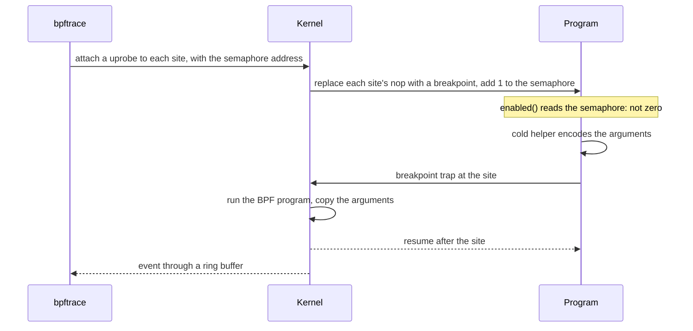
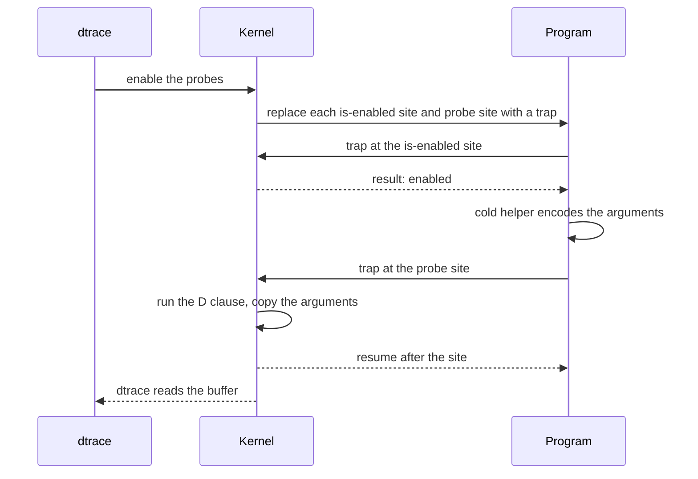
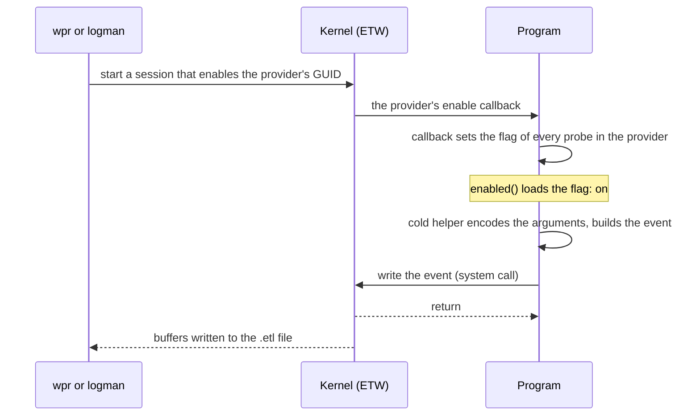

# Performance

What a probe costs with no tracer attached, what it costs while a tracer
records it, and how each platform differs.

| Target | No tracer attached, per probe | Tracer attached, per firing |
|---|---|---|
| Linux | one load and compare of the SDT semaphore: about 0.4 ns | one breakpoint trap into the kernel and the tracer's BPF program: about 0.5 µs in the kernel's own benchmark, not measured here |
| macOS | one instruction that ld64 wrote to set the result to false: about 0.16 ns | two traps into the kernel and the D clause: 0.7 to 2.1 µs measured |
| Windows | one load of an atomic flag: about 0.24 ns | no trap; the event is built in the process and written with one system call: 0.4 to 0.5 µs measured |
| other targets | nothing; the check is the constant `false` | no tracer |

## With no tracer attached

A probe compiles to an enabled check and a branch to a `#[cold]`,
`#[inline(never)]` helper. Only the helper computes and encodes the
arguments, so with no tracer attached the arguments are never evaluated, a
`debug` or `serde` argument is never formatted, and nothing is allocated.
The check on each platform:

- **Linux:** a 16-bit load of the probe's SDT semaphore, compared with zero.
  The kernel raises the semaphore when a tracer attaches to the probe.
- **macOS:** ld64 rewrites each is-enabled call to an instruction that sets
  the result to zero (`mov x0, #0` on AArch64, `xor eax, eax` on x86-64),
  and each probe call to a `nop`.
- **Windows:** a relaxed load of an `AtomicU8` that the ETW enable callback
  sets. The first check of a provider in the process registers it with ETW,
  once.
- **Other targets:** the check is the constant `false` and the compiler
  removes the probe.

Measured with criterion: a function with an entry and a return probe against
the same function without them, as in `crates/anyprobe/benches/disabled_cost.rs`.

| Machine | Without probes | With two probes | Per probe |
|---|---|---|---|
| Apple M1, macOS | 0.95 ns | 1.27 ns | 0.16 ns |
| AMD Threadripper 1950X, Linux x86-64 | 1.63 ns | 2.40 ns | 0.39 ns |
| Same machine, Windows x86-64 | 1.91 ns | 2.40 ns | 0.24 ns |

- Most of the difference is the register saves the cold calls need, not the
  checks. On Linux x86-64 a function with one check measured the same as one
  without: LLVM moved the saves into the cold path. With two checks they stay
  on the hot path.
- On macOS a `#[probe]` function compiles to the same 17-instruction hot
  path as a hand-written pair of checks, against 7 instructions without
  probes.
- A probed function can still be inlined. Each inlined copy is another site
  under the same probe name.
- `--cfg anyprobe_dylib` (Linux, Rust `dylib` crates only) loads the
  semaphore through the GOT: 0.98 ns instead of 0.77 ns for two probes on the
  Threadripper.
- `unwind` adds a guard flag. An `async fn` draws an invocation id only when
  its entry probe is enabled.
- Size: each probe adds its cold helper, its tracer metadata (an SDT note or
  a DOF entry per site) and a registry record of about 150 bytes.

Run the benchmark with `cargo bench -p anyprobe --bench disabled_cost`.
Differences below a nanosecond are within the noise of a laptop on battery or
under load; the instruction count is the steadier comparison.

## With a tracer attached

While a tracer records a probe, each firing runs the cold helper, which
encodes the arguments, and then hands control to the tracer. On Linux and
macOS that is a trap into the kernel. On Windows the program writes the event
itself.

### Linux



The semaphore is raised once, when the tracer attaches, and costs nothing per
firing. Each firing is one trap. The kernel's uprobe benchmark (commit
`d41bc48bfab2`, "selftests/bpf: Add uprobe triggering overhead benchmarks",
Linux 5.17) measured about 0.56 µs for a uprobe on a `nop`, which is what an
SDT site is, against 1.4 µs on another instruction. Later kernels have made
uprobes faster. anyprobe has not measured a firing on Linux.

### macOS



Each firing is two traps: the enabled check is a site of its own. Measured
with the `overhead` example on an Apple M1, macOS 27, 1,000,000 calls of
each function, each call firing an entry and a return probe:

| dtrace action on every probe | `native` | `encoded` |
|---|---|---|
| none attached | 3.1 ns per call | 3.3 ns per call |
| `@[probename] = count()` | 4272 ns per call | 4605 ns per call |
| `printf` of every argument | 1442 ns per call | 3326 ns per call |

That is 0.7 to 2.1 µs per firing. The no-tracer time of the unprobed
function moved between 1.2 and 3.1 ns from one run to the next, which fits
the thread running on an efficiency core in some runs and a performance core
in others, so these runs give the order of magnitude, not a precise figure.
Formatting the small struct in `encoded` with `{:?}` added about 0.3 µs per
call in the counting run.

### Windows



There is no trap and nothing in the program's code changes. Each firing
builds the event in a thread-local buffer, writing the event name and field
names along with the values, and makes one system call. Measured with the
`overhead` example on an AMD Threadripper 1950X, Windows 11 Home (10.0.26100),
Balanced power plan, 100,000 calls of each function, each call firing an
entry and a return probe, with a session recording every event:

| Session | `native` | `encoded` |
|---|---|---|
| none attached | 2.6 ns per call | 2.4 ns per call |
| `wpr` with the generated profile, to a file | 864 ns per call | 1093 ns per call |
| `logman` with 1024 KB buffers, to a file | 847 ns per call | 1086 ns per call |

That is 0.4 to 0.5 µs per firing, with `encoded` about 0.1 µs higher for
formatting its argument with `{:?}`. Both sessions used 1024 KB buffers, at
least 64 of them. `tracerpt` counted 800,072 events in the `wpr` trace (133 MB)
and 800,002 in the `logman` trace (130 MB), against the 800,000 the example
fires, and no lost events or buffers in either. An earlier `logman` run with
its default buffers wrote a 58 MB trace, which fits dropped events, so
the buffer size matters for a program that fires this fast. Each figure is one
run.

A session enables a whole provider, so every probe in it turns on together.
On Linux and macOS a tracer turns on only the probes it names.

## Planning for the attached cost

At 1 µs per firing, a probe that fires 100,000 times a second takes about a
tenth of a CPU core while it is traced. A predicate in the tracer (a bpftrace
filter, a D predicate) runs after the trap, so it reduces output but not the
cost of the firing. Probes at request or task boundaries cost little even
while traced; a probe in an inner loop can slow the program noticeably when
something attaches to it.

When a tracer's buffers fill, it drops events rather than block the program:
bpftrace reports lost events, dtrace reports drops, and ETW counts lost
events in the session.

## Measuring it

The `overhead` example prints the time per call of an unprobed function and
of two probed ones, `native` (native arguments) and `encoded` (a `debug`
argument). Run it with no tracer, then under one that enables every probe:

```text
cargo build --release -p anyprobe --example overhead

# macOS
sudo dtrace -q -c 'target/release/examples/overhead 1000000' \
  -n 'overhead$target:::* { @[probename] = count(); }'

# Linux
sudo bpftrace -c "$PWD/target/release/examples/overhead 1000000" \
  -e "usdt:$PWD/target/release/examples/overhead:overhead:* { @[probe] = count(); }"
```

On Windows, start a session with the profile from
`cargo anyprobe wprp target\release\examples\overhead.exe` before running the
example; see [usage/windows.md](usage/windows.md#measuring-overhead).
